**Vibe Commerce - E-Commerce Platform**
A full-stack e-commerce application built with React and Node.js for the screening assignment.

⭐Features
1. User authentication (signup/login)
2. Product browsing with categories
3. Shopping cart management
4. Checkout process
5. Order confirmation
6. Responsive design

⭐Tech Stack
Frontend: React, Vite, CSS
Backend: Node.js, Express, MongoDB
Authentication: JWT, Bcrypt

⭐Quick Start

1. Setup Backend
bash
cd backend
npm install
npm start

2. Setup Frontend
bash
cd frontend
npm install
npm run dev

3. Access Application
Open http://localhost:3000

⭐Environment Setup
Backend (.env)
env
PORT=4000
MONGODB_URI=mongodb+srv://<username>:<password>@cluster0.5czxw.mongodb.net/vibe-commerce
CORS_ORIGIN=http://localhost:3000
Frontend (.env)
env
VITE_API_BASE_URL=http://localhost:4000/api

⭐API Endpoints
POST /api/auth/signup - User registration
POST /api/auth/login - User login
GET /api/products - Get all products
POST /api/cart - Add to cart
POST /api/checkout - Process order

⭐How to Use
1. Create an account or login
2. Browse products and add to cart
3. View cart and update quantities
4. Complete checkout with your details
5. Receive order confirmation

⭐Project Structure
backend/
  ├── controllers/
  ├── models/
  ├── routes/
  └── server.js

frontend/
  ├── components/
  ├── pages/
  └── App.jsx

⭐  Email Setup Guide

1. Enable Gmail App Password
   Go to Google Account Security
   Enable 2-Step Verification
   Generate App Password:
   Go to Security → 2-Step Verification → App passwords
   Select Mail as app
   Select Other and name it "Vibe Commerce"
   Copy the 16-character password

2. Update Backend Configuration
Edit backend/.env file:

env
EMAIL_USER=your-email@gmail.com
EMAIL_PASSWORD=your-16-character-app-password
EMAIL_SERVICE=gmail
EMAIL_FROM=Vibe Commerce <your-email@gmail.com>

Screenshots

1. Login Page
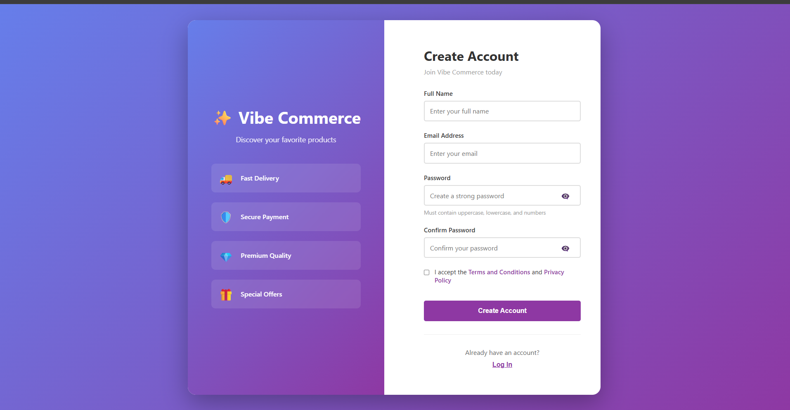

2. Sign Up Page
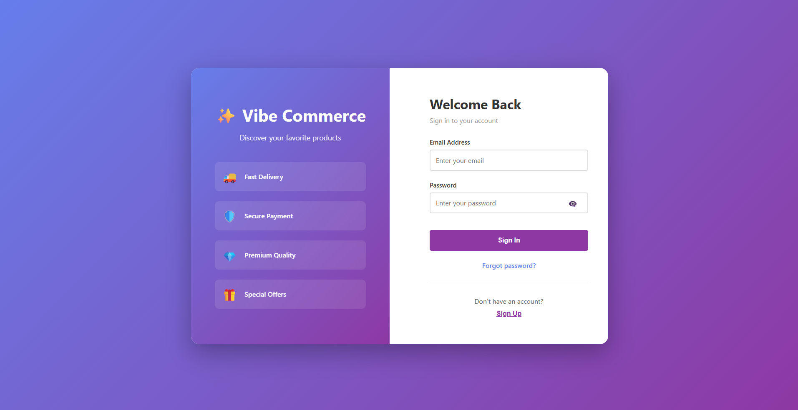

3. Home Page
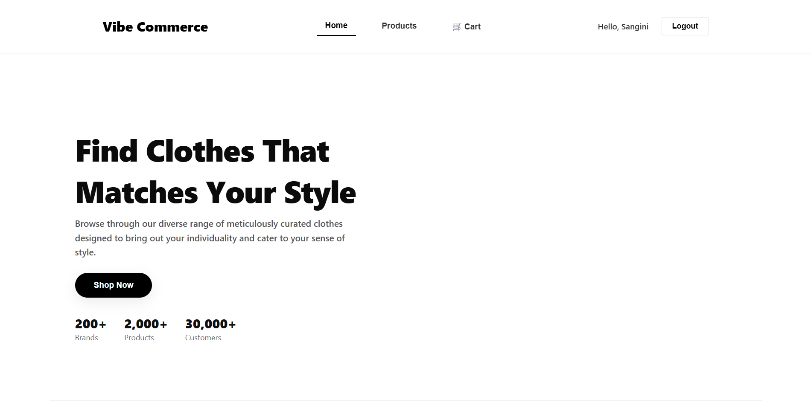

4. Products
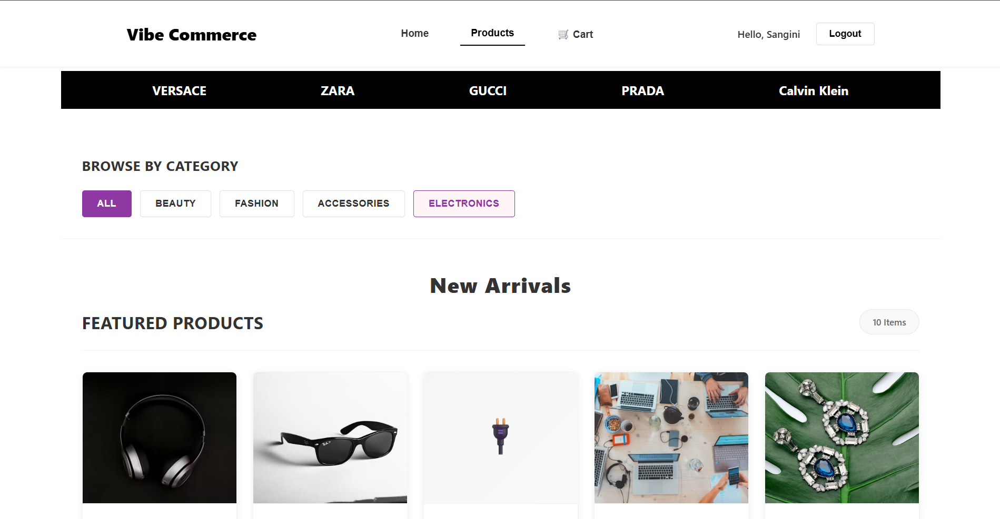
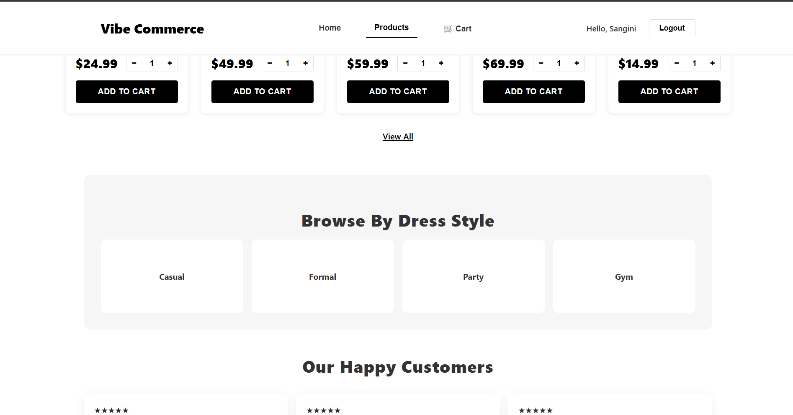

5. Product Interactions- Add to cart
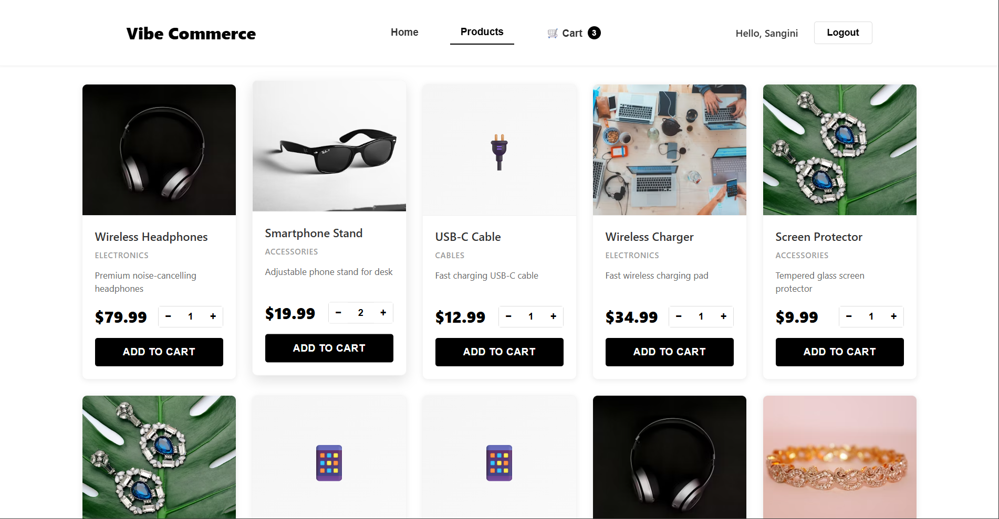
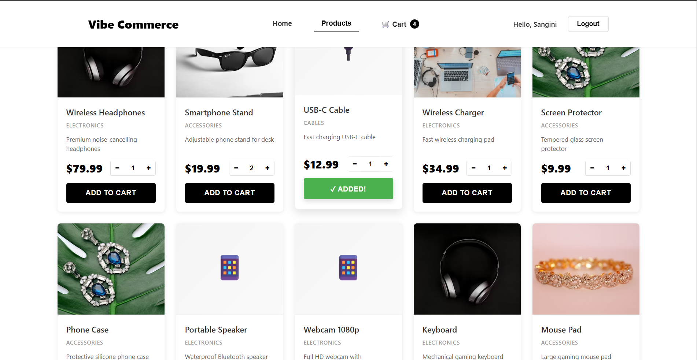
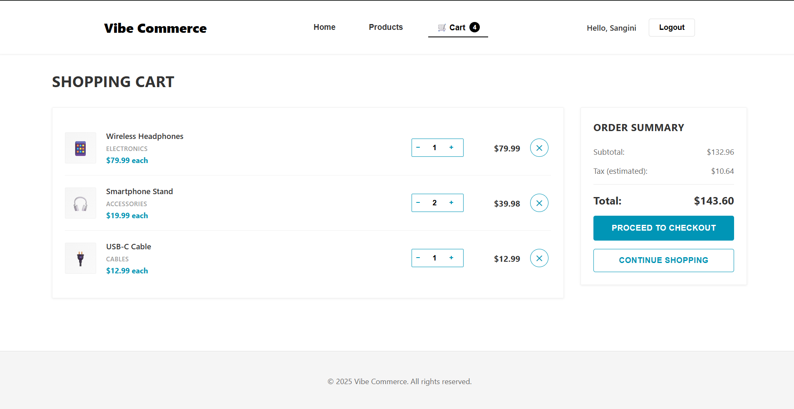

6. Checkout Process

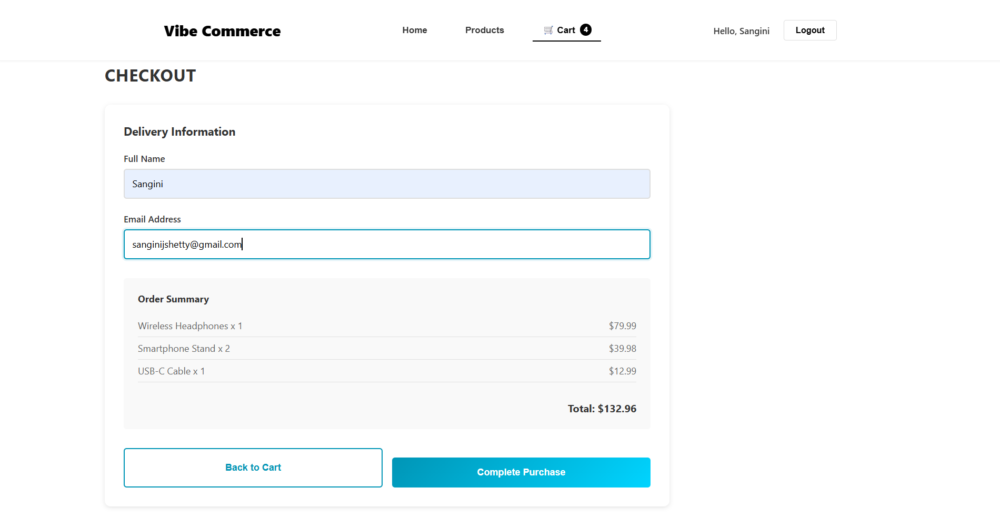
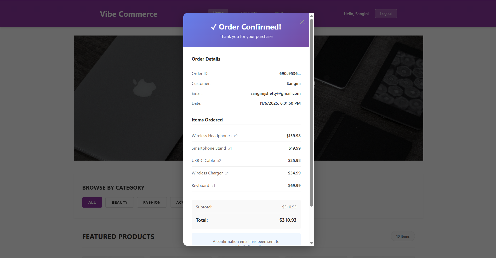

7. Order Confirmation in mail
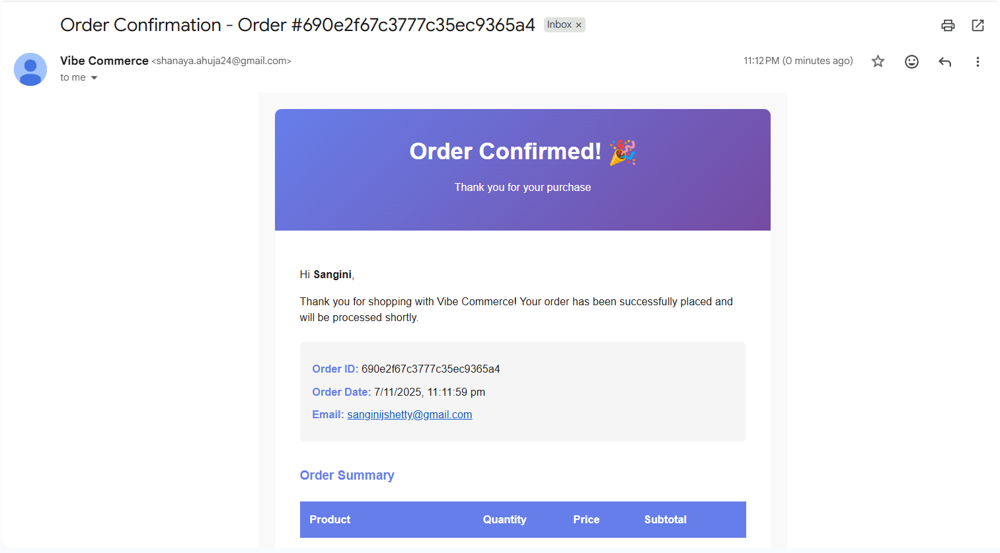
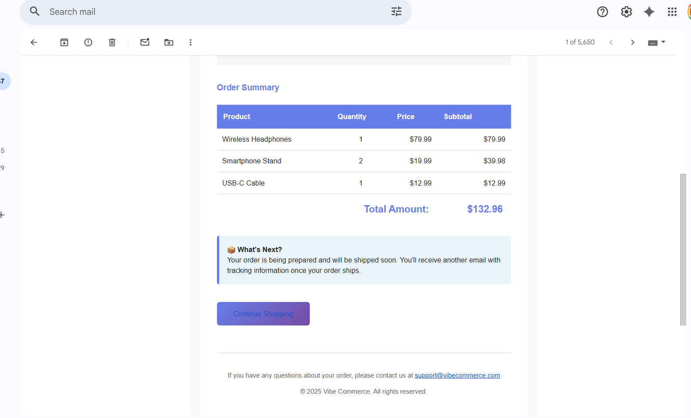
